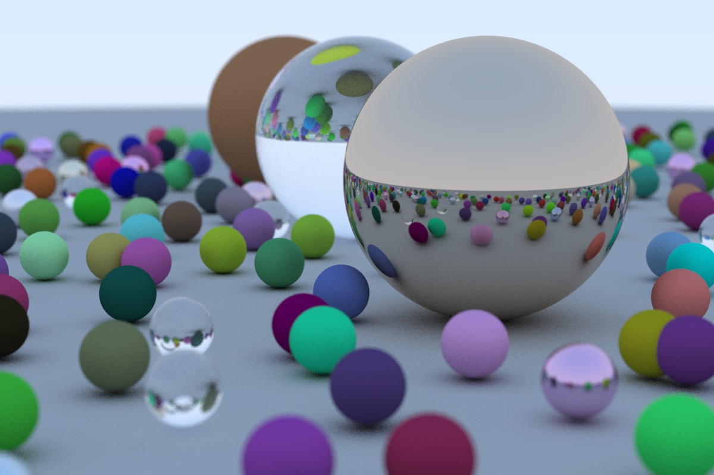

## Ray tracing in one weekend, in Rust

This is an implementation in Rust of [Peter Shirley's "Ray Tracing In One Weekend"](https://github.com/petershirley/raytracinginoneweekend) book.
This is the first of the series:

- Ray tracing in one weekend, in Rust
- [Ray tracing: the next week, in Rust](https://github.com/fralken/ray-tracing-the-next-week)
- [Ray tracing: the rest of your life, in Rust](https://github.com/fralken/ray-tracing-the-rest-of-your-life)

Every tagged commit is the code that generates a specific image. In this way it's easy to follow the progress in the book.
First `git clone` this project. Then you can checkout a `tag` to retrieve the implementation at a specific chapter in the book.
For example, with `git checkout tags/chapter_08.2` you get the implementation for the second image of chapter 8.
With `git checkout master` you go back to the latest version. 

Instead of implementing my own `vec3`, I preferred using `Vector3` from [`nalgebra`](https://crates.io/crates/nalgebra) crate.
For random numbers I used [`rand`](https://crates.io/crates/rand).

Hence dependencies are:
- [`nalgebra`](https://www.nalgebra.org)
- [`rand`](https://rust-random.github.io/book/)

### What next

You can go on with my Rust implementation for the second book, ["Ray tracing: the next week, in Rust"](https://github.com/fralken/ray-tracing-the-next-week).

### Improvements

- I easily made the main loop parallel with the [`rayon`](https://crates.io/crates/rayon) crate.
Just make sure that Traits are marked `Sync` and then it's just a matter of using an `into_par_iter()` iterator.

